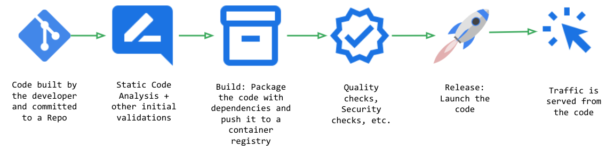

# Secure Software Supply Chain (S3C) in Serverless world
## Binary Authorization with Cloud Run

## tl;dr (before jumping to code)
Building a secure software supply chain is a relatively new topic. [New compliance and regulations requirements](https://www.whitehouse.gov/briefing-room/presidential-actions/2021/05/12/executive-order-on-improving-the-nations-cybersecurity/) will challenge organizations to think differently about Software Security. Many recent hacks have shown us time and again that traditional methods of simply keeping code in private repositories, doing regular repo scans and runtime scans will not be sufficient in future. 

This blog tries to define what Secure Software Supply Chain is, why it is important, what are the key challenges in building it and also, demonstrates a no-ops method to build a S3C using Cloud Run, Cloud Build and Binary Authorization in Google Cloud. 

[Source Code Repository](https://github.com/kapsay/SecureSoftwareSupplyChain)

## Problem Statement
Security is a major pillar of a Cloud Adoption Framework and Operating Model you pick from any Cloud Provider. It is definitely an Important pillar at Google Cloud. Adopting cloud at scale with all security measures and compliance controls in place can be a daunting task for an organization. One of the primary reasons for this is modern threats hits at many layers of the "stack". When I say stack it comprises of all the components involved in serving your users and/or applications.

Modern software architecture and the software delivery is also getting very complex with several tools added in the develop, build and release chain. Many times security tools and policies are introduced as external entities in this chain. 

As we all know that Security is a very deep and wide topic, and we can not possibly address every security aspect in a single article (or even a book), so let's focus on this Secure Software Supply Chain aka S3C here and explore it in detail.

## What is Secure Software Supply Chain aka S3C
So first let's try to define Software Supply Chain and some of the vulnerabilities that can be introduced through it. 

At a high level, probably we all know how a food supply chain look like. Take one example; eggs. Eggs are produced in large poultry farms and before coming to your breakfast plate, they go through a journey. Picture below tries to shows that journey. 


Code has a similar journey. It has to go thru several steps before it starts serving traffic in production. While everyone's build-release pipelines are different, this picture shows some of the common steps used in software release pipelines. 



Now, there is a fundamental security gap here. **What is making sure that only an "Approved" and "Intended" software can be deployed in the targeted environment?** In egg supply chain example; how will you make sure that some malicious actor is not putting "Bad Eggs" in the grocery store shelf and you end up buys those bad eggs? As you can guess, one bad egg on the shelf can have a severe health impact on this grocery chain's customers. 
Same way what is preventing a malicious actor (internal or external) to inject a bad dependency in the software supply chain that can cause major security issues for an organization?

Many such security gaps pop-up very frequently these days in some major software platforms and impacts organizations of any size. The impacts of broken software supply chains are such that in **recent ["Executive Order on Improving the Nation’s Cybersecurity"](https://www.whitehouse.gov/briefing-room/presidential-actions/2021/05/12/executive-order-on-improving-the-nations-cybersecurity/) federal government put a specific section (Section 4) about "Enhancing Software Supply Chain Security"**

Section 4.e.3 specifically calls out to employ automated tools, or comparable processes, to maintain trusted source code supply chains, thereby ensuring the integrity of the code.

This is a fundamental change in how we traditionally thought about software security, mostly as an afterthought in software delivery.

Another major challenge that is introduced by this is the introduction of many tools in the software supply chain + operations of those tools + effort to integrate those tools. For a software developer and to a business; it is an added overhead, since software developers want to just develop the code and business wants to use it as quickly as possible. So it's challenging to keep the right balance. 

So the fundamental questions for an organization here are:
1. How to build a S3C, with a policy (as a Code) driving the decision to deploy or not deploy a code in runtime? 
2. Software is built and shipped as quickly as possible without too much of a friction?
3. Not take more operational overhead by introducing tools to build such a S3C?

## Few solutions to build a S3C

- One answer may be is to put some manual checks and validations before deployment. Well, agree, but we all know with rapid development and frequent deployments it is nearly impossible to do such validations manually without impacting the velocity. This is not a good answer to question#2.
- Another option may be to introduce 3rd party tools that validate and attest your software before going to runtime. Generally these tools will bring in a lot of operational overhead. For example, you need to install these tools somewhere, upgrade them with new versions, monitor them to make sure they are up and running, and many more.. This is not a good answer to question#3 above.

Is there a better solution? Here comes **Binary Authorization** for rescue. 

## What is Binary Authorization and Architecture
So, now let's explore what Binary Authorization is in detail. Binary Authorization is a managed service in Google Cloud that helps build deploy-time security controls to ensure only trusted/approved container image can be deployed in the runtimes environments like Google Kubernetes Engine (GKE) or Cloud Run. 

Being a fully managed service, to adopt Binary Authorization you do not have to stand up any infrastructure or build an operations team. Just enable the BInary Authorization API in your project and you are ready to go.
This solves for question#3. 

There are 4 major components to S3C using Binary Authorization:
1. A Policy - A set of rules defined as Code that governs the deployment of container images. Rules in a policy provide specific criteria that an image must satisfy before it can be deployed. If policy requires attestations before deployment, you must also set up attestors that can verify attestations before allowing associated images to deploy.
2. KMS - Used in generating public and private keys that are used in signing and validating images.
3. Signer - Signs the unique image descriptor (image digest) with a private key generated thru KMS. This produces a "signature" which is later (at the time of deployment) verified by Binary Authorization to make sure that a signed image is deployed.
4. Attestor - has a public key that corresponds to the private key used by a signer to sign the container image digest and create attestation. 

Binary Authorization uses Policy, Signer and Attestor to validate the image and decide if it is OK to deploy that image in the targeted run time or reject the deployment.

Here is an architecture that shows the working of Binary Authorization. 


This Architecture shows how Binary Authorization enforces a policy to makes sure that if there is any critical vulnerability exists in the image/code then the image will not get deployed in Cloud Run. In order to accomplish this the image is signed after vulnerability scanning (a built-in feature in Google Container Registry) when no critical vulnerability is found. 

There might be other scenarios (mentioned above) where you want to make sure that the image is deployed whe it passes QA checks (it is up to you to define what that QA check really mean). 

In any case, if a malicious actor tries to deploy an image in Cloud Run that is not signed by the defined supply chain then Binary Authorization won't let it go to. 

One of the biggest benefits of this architecture is the clear separation of duties, for example:
1. Security Team - write Binary Authorization Policy in YAML. Grant exception if at all needed, again thru a change in Policy YAML.
2. Foundation/Infrastructure Team - use GCP Project creation process to enforce Binary Authorization Policy. This is done mostly in Terraform and is explained in detail below.
3. Build & Release Team - creates build and release scripts, may be in Cloud Build using cloudbuild.yaml, to enforce the standards like, image vulnerability scanning, other QA checks, etc. 
4. Developers - can't change #1, #2 or #3 that will allow a complete focus on shipping code. 

## The Code - Terraform

All the code is available in the repository. 

### Phase I - The Setup 
**Personas** - Security and Foundation/Infrastructure Team
[Repository](https://github.com/kapsay/SecureSoftwareSupplyChain)

**Prerequisites**

1. Enable Following APIs in your Google Cloud Project:
- Binary Authorization API
- Cloud Build API
- Cloud Key Management Service (KMS) API
- Container Analysis API
- Cloud Source Repositories API (if you are keeping your source code in there)


2. Setup "Allowed Binary Authorization Policies (Cloud Run)" policy for your project as described at 
https://cloud.google.com/binary-authorization/docs/run/requiring-binauthz-cloud-run

3. Let's go thru the variables we're going to use in the code

```javascript
POLICY_PROJECT_ID = "GCP Project ID" 
POLICY_REGION     = "One of the GCP Regions, like `us-central1`" 
CLOUD_BUILD_SA    = "Cloud Build Service Account, like project-number@cloudbuild.gserviceaccount.com" 
BA_KEYRING        = "Key Ring Name"
BA_KEY            = "Key Name"
BA_NOTE_ID        = "Note ID"
BA_NOTE_NAME      = "Note Name"
BA_VULNERABILITY_ATTESTOR = "Attestor Name"
```

**Step 1.** Create a keyring and a Key using Cloud KMS 

```javascript
resource "google_kms_key_ring" "kms_ring" {
    project  = var.POLICY_PROJECT_ID
    name     = var.BA_KEYRING
    location = var.POLICY_REGION
}

resource "google_kms_crypto_key" "kms_key" {
    depends_on = [
      google_kms_key_ring.kms_ring
    ]
    name            = var.BA_KEY
    key_ring        = google_kms_key_ring.kms_ring.id
    purpose  = "ASYMMETRIC_SIGN"
  
    version_template {
        algorithm = "RSA_SIGN_PKCS1_4096_SHA512"
    }
}
```
**Step 2.** Create a Container Analysis Note, which is the metadata that describes a piece of software. Container Analysis API (An implementation of the Grafeas API) stores, enables querying and retrieval of  notes. Assign Cloud Build service account role to retrieve/view the note. 

```javascript
resource "google_container_analysis_note" "note" {
    name    = var.BA_NOTE_NAME
    project = var.POLICY_PROJECT_ID  
    attestation_authority {
      hint {
        human_readable_name = "No Vulnerability Note"
      }
    }
}

resource "google_project_iam_member" "permission_iam" {
    depends_on = [
      google_kms_crypto_key.kms_key
    ]
    project = var.POLICY_PROJECT_ID
    role    = "roles/containeranalysis.notes.occurrences.viewer"
    member  = "serviceAccount:${var.CLOUD_BUILD_SA}"
}
```

**Step 3.** Create an attestor that uses the note created in step 2 to attest to container image artifact. We are naming it as "No Vulnerability Attestor" and using the KMS Public keys (created in Step 1) to verify attestations signed by this attestor.

```javascript
resource "google_binary_authorization_attestor" "attestor" {
    depends_on = [
      google_container_analysis_note.note
    ]

    name = var.BA_VULNERABILITY_ATTESTOR
    description = "No vulnerability attestor"
    project = var.POLICY_PROJECT_ID
    attestation_authority_note {
      note_reference = "projects/${var.POLICY_PROJECT_ID}/notes/${var.BA_NOTE_ID}"
      public_keys {
        id = data.google_kms_crypto_key_version.key_version.id
        pkix_public_key {
          public_key_pem      = data.google_kms_crypto_key_version.key_version.public_key[0].pem
          signature_algorithm = data.google_kms_crypto_key_version.key_version.public_key[0].algorithm
        }
      }
    }
}
```

**Step 4.** Create a policy to be enforced in the project. You can customize this policy in whatever way you want by using [Policy Reference guide](https://cloud.google.com/binary-authorization/docs/policy-yaml-reference)

```javascript
resource "google_binary_authorization_policy" "policy" {
    depends_on = [
      google_binary_authorization_attestor.attestor
    ]
    project  = var.POLICY_PROJECT_ID
    admission_whitelist_patterns {
      name_pattern  = "gcr.io/sw-supply-chain-demo/hello"
    }
    admission_whitelist_patterns {
      name_pattern  = "gcr.io/google_containers/*"
    }
    admission_whitelist_patterns {
      name_pattern  = "k8s.gcr.io/*"
    }
    admission_whitelist_patterns {
      name_pattern  = "gke.gcr.io/*"
    }
    admission_whitelist_patterns {
      name_pattern  = "gcr.io/stackdriver-agents/*"
    }
    admission_whitelist_patterns {
      name_pattern  = "gcr.io/google-containers/*"
    }

    default_admission_rule {
        evaluation_mode  = "REQUIRE_ATTESTATION"
        enforcement_mode = "ENFORCED_BLOCK_AND_AUDIT_LOG"
        require_attestations_by = [google_binary_authorization_attestor.attestor.name]
    }

    global_policy_evaluation_mode = "ENABLE"
}
```

**Step 5.** Assign Cloud Build service account viewer permission of Binary Authorization Attestors and permission to sign and verify.  

```javascript
resource "google_binary_authorization_attestor_iam_member" "member_viewer" {
    depends_on = [
      google_container_analysis_note.note,
      google_binary_authorization_attestor.attestor
    ]
    project = var.POLICY_PROJECT_ID
    attestor = google_binary_authorization_attestor.attestor.name
    
    role = "roles/binaryauthorization.attestorsViewer"
    member = "serviceAccount:${var.CLOUD_BUILD_SA}"
}

resource "google_kms_key_ring_iam_member" "key_ring_iam" {
  depends_on = [google_kms_key_ring.kms_ring]
  key_ring_id = google_kms_key_ring.kms_ring.id
  role        = "roles/cloudkms.signerVerifier"
  member      = "serviceAccount:${var.CLOUD_BUILD_SA}"
}
```

**Step 6.** Grant the Cloud Build service account permission to view and attach the note (created above) to container images. I did not see a Terraform module for it, so I called the APIs to do it. Script to call the API is stored in notePermission.sh, which is called by Terraform (just to keep the terraform state of whole process at one place)

```javascript
resource "null_resource" "ba-grant-role-note" {
  depends_on = [null_resource.ba-analysis-note]
  provisioner "local-exec" {
    environment = {
      POLICY_PROJECT_ID = var.POLICY_PROJECT_ID
      BINAUTH_NOTE_ID = var.BA_NOTE_ID
      CLOUD_BUILD_SA_EMAIL = var.CLOUD_BUILD_SA
    }
    command  = "sh notePermission.sh"
  }
}
```

`notePermission.sh`

```shell 
curl "https://containeranalysis.googleapis.com/v1/projects/${POLICY_PROJECT_ID}/notes/${BA_NOTE_ID}:setIamPolicy" \
--request POST \
--header "Content-Type: application/json" \
--header "Authorization: Bearer $(gcloud auth print-access-token)" \
--header "X-Goog-User-Project: ${POLICY_PROJECT_ID}" \
--data-binary @- <<EOF
    {
    "resource": "projects/${POLICY_PROJECT_ID}/notes/${BA_NOTE_ID}",
    "policy": {
        "bindings": [
        {
            "role": "roles/containeranalysis.notes.occurrences.viewer",
            "members": [
            "serviceAccount:${CLOUD_BUILD_SA}"
            ]
        },
        {
            "role": "roles/containeranalysis.notes.attacher",
            "members": [
            "serviceAccount:${CLOUD_BUILD_SA}"
            ]
        }
        ]
    }
    }
EOF
```

This is all the code you'd need to setup all componenets in the project to use Binary Authorization. You can now init, plan, show and apply this terraform using a Cloud Build trigger. Here is a sample cloudbuild.yaml to perform these steps

```yaml
steps:
- name: 'ubuntu'
  args: ['bash', './myscript.sh']
  env:
  - 'PROJECT_ID=$PROJECT_ID'
  - 'PROJECT_NUMBER=$PROJECT_NUMBER'

- id: 'tf init'
  name: 'hashicorp/terraform:1.0.0'
  entrypoint: 'sh'
  args: 
  - '-c'
  - | 
      echo "*************** TERRAFOM INIT START ******************"
      terraform init
      echo "*************** TERRAFOM INIT ENDS ******************"

- id: 'tf plan'
  name: 'hashicorp/terraform:1.0.0'
  entrypoint: 'sh'
  args: 
  - '-c'
  - | 
      echo "*************** TERRAFOM PLAN START ******************"
      terraform plan
      echo "*************** TERRAFOM PLAN ENDS ******************"

- id: 'tf show'
  name: 'hashicorp/terraform:1.0.0'
  entrypoint: 'sh'
  args: 
  - '-c'
  - | 
      echo "*************** TERRAFOM SHOW START ******************"
      terraform show
      echo "*************** TERRAFOM SHOW ENDS ******************"

- id: 'tf apply'
  name: 'hashicorp/terraform:1.0.0'
  entrypoint: 'sh'
  args: 
  - '-c'
  - | 
      echo "*************** TERRAFOM APPLY START ******************"
      terraform apply -auto-approve
      echo "*************** TERRAFOM APPLY ENDS ******************"
```

One Terraform Apply is done successfully, you can see all the components using the cloud console. 

### Phase I - The setup 
**Persona** - Build & Release Team

Once the setup is done, let's go to the image verification, attestation and deployment phase. 

Goal of this step is
1. List tags and digests for the specified image 
2. List container analysis data for a given image and see if there is any "Critical Vulnerabilities" identified in it or not:
  - If no critical vulnerabilities identified then use the attestor created in the phase I to sign that image
  - If there are critical vulnerabilities identified then do not sign the image and display a GCR link to the place where these vulnerabilities are listed

```shell
image_name="gcr.io/$PROJECT_ID/$CLOUD_RUN_APP_NAME"

digest_value=$(gcloud beta container images list-tags $image_name --format="table[no-heading](digest.slice(0:256).join(''))" --limit=1)

echo "----- $digest_value"

vuln_counter=$(gcloud beta container images describe $image_name@$digest_value --show-package-vulnerability --format="table[no-heading](package_vulnerability_summary.vulnerabilities.CRITICAL[].vulnerability.cvssScore)")
echo "----- $vuln_counter"

if [[ $vuln_counter == "" ]]
then
    echo "Continue - No Critical vulnerability found"
    gcloud beta container binauthz attestations sign-and-create --artifact-url $image_name@$digest_value --attestor=$BA_VULNERABILITY_ATTESTOR --attestor-project=$PROJECT_ID --keyversion="1" --keyversion-key=$BA_KEY --keyversion-location="us-central1" --keyversion-keyring=$BA_KEYRING --keyversion-project=$PROJECT_ID

    echo "Image attestation Binary Authorization is done..."
else
     
    echo "STOP!!! - Critical vulnerability found. Find vulnerability details at - "
    result_url="https://console.cloud.google.com/gcr/images/$PROJECT_ID/GLOBAL/$CLOUD_RUN_APP_NAME@$digest_value/details?tab=vulnz&project=$PROJECT_ID&organizationId=752378518739&supportedpurview=project&gcrVulnzListsize=30"
    echo "$result_url"
fi

```

### Phase III - Cloud Run Deployment

**Persona** - Developers

If you try to deploy an image that is not signed by the process above then you'll get an error: 

`Service update rejected by Binary Authorization policy: Container image '<image path>' is not authorized by policy. Image '<image path>' denied by attestor projects/<project name>/attestors/<attestor name>: No attestations found that were valid and signed by a key trusted by the attestor`

Deployment of signed images to Cloud Run will go fine. 

## Conclusion
Google has internally championed the S3C for a long time and has built several tools for Google Cloud customers that are based upon open source to not only build S3C but make sure that customers are not taking any unnecessary operational overhead. Pieces of these tools are designed to address separation of duties concerns. 
S3C is/will-be an important aspect of how software is delivered and secured and technology discussed in this post will help the adoption. 